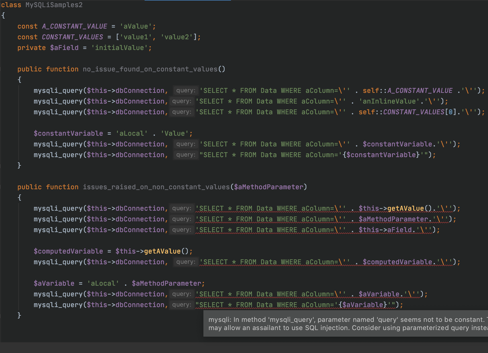
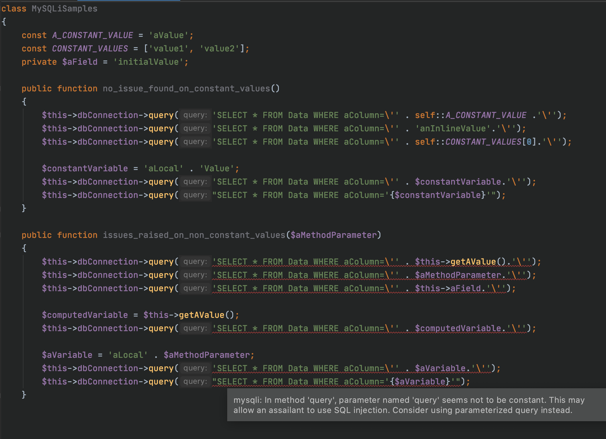
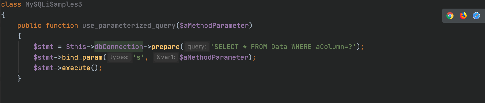
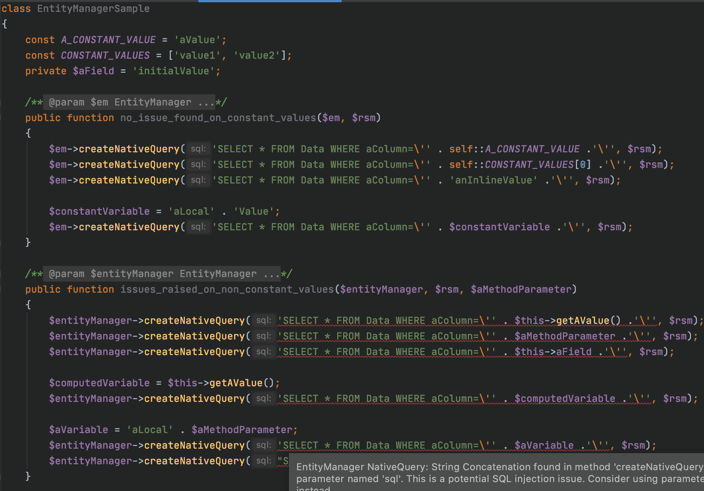
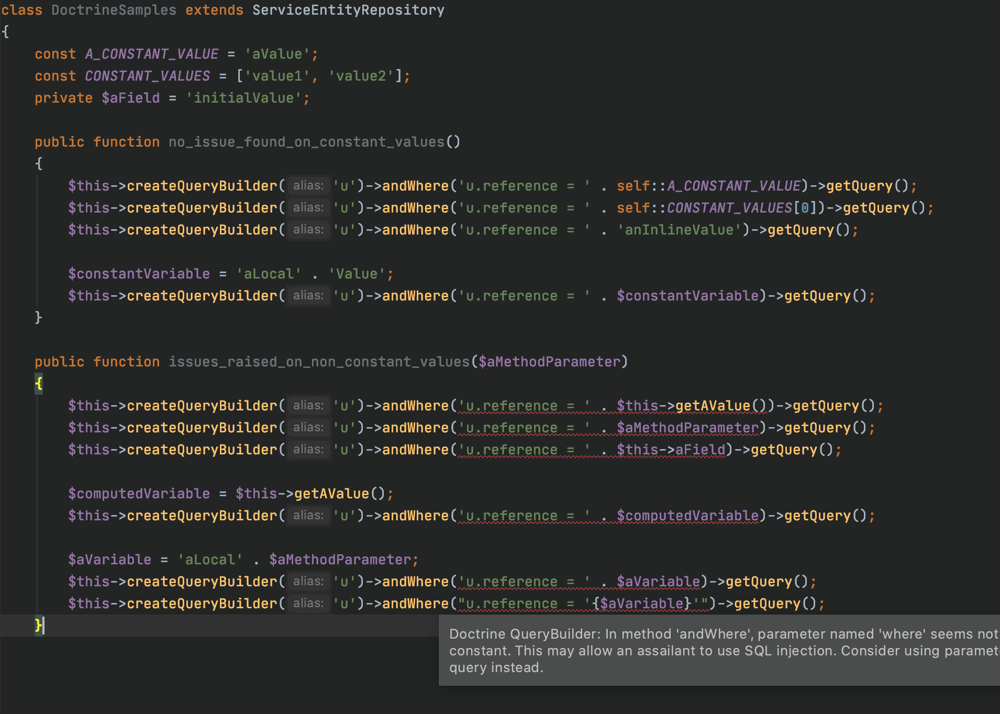
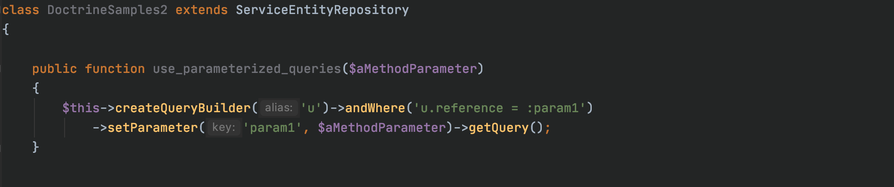

## SQL Injection Detection Plugin for PHPStorm IDE
Author: Guillaume MICHEL (guillaumem@theodo.fr)

## MySQL Improved Extension
See: https://www.php.net/manual/en/book.mysqli.php
#### mysqli Code samples:
###### no Problem highlighted:
``` php
    public function noProblemFound($link)
    {
        // constant string
        mysqli_query($link, "SELECT * FROM Data WHERE aColumn='aValue'");

        // variable with only constant assignments
        $sql = "SELECT * FROM Data WHERE aColumn='aValue'";
        mysqli_query($link, $sql);

         // constant concatenation of constants
         mysqli_query($link, "SELECT * FROM Data WHERE " . " aColumn='aValue'");
       
         // constant concatenation of constants
         mysqli_query($link, "SELECT * FROM Data WHERE " . MyClass::aConstant);
    }
```

###### Potential SQL Injection warning issued:
``` php
    public function warningFound($link, $param)
    {
        // concatenation that implies class field (non constant)
        // If $this->aField is not constant, its value is not controlled. It can be used to inject malicious condition.
        mysqli_query($link, "SELECT * FROM Data WHERE aColumn=" . $this->aField);
        // Prefer: 
        // $stmt = $mysqli->prepare("SELECT * FROM Data WHERE aColumn=?");
        // $stmt->bind_param("s", $this->aField);
        // See: https://www.php.net/manual/en/mysqli.prepare.php

        // concatenation that implies method parameter (non constant)
        // If $param is not constant, its value is not controlled. It can be used to inject malicious condition.
        mysqli_query($link, "SELECT * FROM Data WHERE aColumn=" . $param);

        // concatenation that implies non constant variable(non constant)
        $sql = $this->getValue();
        mysqli_query($link, "SELECT * FROM Data WHERE aColumn=" . $sql);
    }
```







## Doctrine
See: https://www.doctrine-project.org/
#### Doctrine EntityManager Code samples:
###### Potential SQL Injection warning issued:
``` php
    public function warningFound($entityManager, $rsm, $param)
    {
        // concatenation that implies method parameter (non constant)       
        $query = $entityManager->createNativeQuery('SELECT * FROM users WHERE name = ' . $param, $rsm);
        
        // concatenation that implies non constant variable (non constant)       
        $sql = $this->getValue();
        $query = $entityManager->createNativeQuery('SELECT * FROM users WHERE name = ' . $sql, $rsm);

        // concatenation that implies class field (non constant)       
        $query = $entityManager->createNativeQuery('SELECT * FROM users WHERE name = ' . $this->aField, $rsm);

        // and so on...
    }
```




#### Doctrine QueryBuilder Code samples:
###### no Problem highlighted:
``` php
    public function noProblemFound()
    {
        // constant concatenation
        $this->createQueryBuilder('u')
                ->andWhere('u.reference LIKE ' . 'ggggg')
                ->getQuery()
                ->getOneOrNullResult();

         // constant concatenation
         $this->createQueryBuilder('u')
                 ->andWhere('u.reference LIKE ' . MyClass::aConstant)
                 ->getQuery()
                 ->getOneOrNullResult();

         // constant concatenation
         $this->createQueryBuilder('u')
                 ->andWhere('u.reference LIKE ' . MyClass::constantsArray[0])
                 ->getQuery()
                 ->getOneOrNullResult();

        // variable with only constant assignments
        $name = 'ttt';
        $this->createQueryBuilder('u')
                ->andWhere('u.reference LIKE ' . $name)
                ->getQuery()
                ->getOneOrNullResult();
    }
```

###### Potential SQL Injection warning issued:
``` php
    public function warningFound($param)
    {
        // concatenation that implies method parameter (non constant)       
        $this->createQueryBuilder('u')
                ->andWhere('u.reference LIKE ' . $param)
                ->getQuery()
                ->getOneOrNullResult();

        // concatenation that implies method field (non constant)       
        $this->createQueryBuilder('u')
                ->andWhere('u.reference LIKE ' . $this->aField)
                ->getQuery()
                ->getOneOrNullResult();

        // direct usage of param      
        $this->createQueryBuilder('u')
                ->andWhere($param)  // RISKY
                ->getQuery()
                ->getOneOrNullResult();

        // direct usage of field      
        $this->createQueryBuilder('u')
                ->andWhere($this->aField)  // RISKY
                ->getQuery()
                ->getOneOrNullResult();

        // variable with at least one non constant assignments
        $name = 'ttt';
        $name = $this->getValue();
        $this->createQueryBuilder('u')
                ->andWhere('u.reference LIKE ' . $name)
                ->getQuery()
                ->getOneOrNullResult();
    }
```





### Changes:
* First version of the plugin.
* Manage more precisely function arguments
* Manage variables flow (detect non constant assignments)
    * When parameter value of SQL methods is constant or constant composition: no problem
    * When parameter value of SQL methods is a parameter of enclosing function: warning issued
    * When parameter value of SQL methods is class field (non constant): warning issued
    * When parameter value of SQL methods is a local variable, check if all assignments are constant
        * For local variables, when at least one assignment is not constant: issues a warning
    * Focus only on parameters of type String or Mixed (unknown)
        * Type detection retrieved from both php code (class + interfaces) and from php-doc
